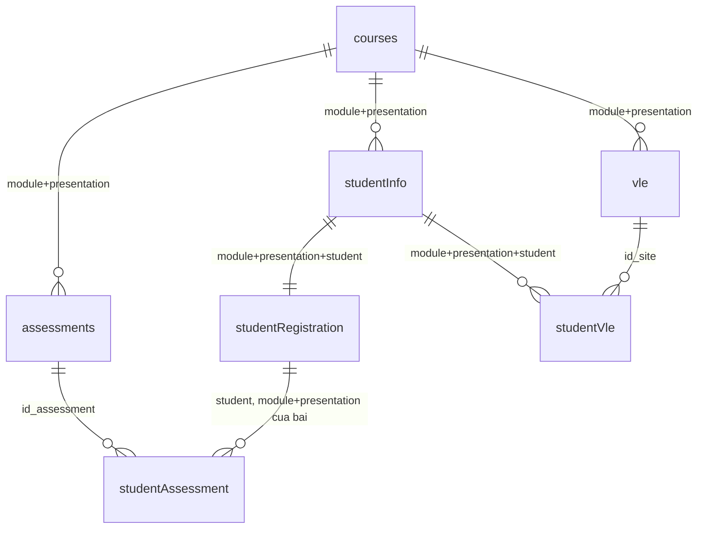

# OULAD — Data Dictionary (tiếng Việt)

**Trạng thái:** `v1.0-draft` — đã đối chiếu với hai lần profiling đầy đủ trên toàn bộ 7 file (script v1 và v2, DuckDB 1.5.5; xem `metadata/profile_report.json`, `metadata/source_manifest.json`). Mọi ô cần số liệu đã được đo. Còn chờ nhóm duyệt các phát hiện ở mục 10 và đối chiếu ý nghĩa cột với tài liệu gốc.
**Nguồn:** Open University Learning Analytics Dataset (OULAD) — figshare, giấy phép CC-BY 4.0. Chi tiết provenance xem `README.md`.

## 0. Cách đọc

### Thang độ chắc chắn

| Nhãn | Nghĩa |
|---|---|
| `Confirmed` | Có số liệu đo trực tiếp trong `profile_report.json` / `source_manifest.json` |
| `Inferred` | Suy ra từ tên cột hoặc mô tả công bố của OULAD, chưa đối chiếu lại tài liệu gốc |
| `Needs validation` | Còn thiếu bằng chứng hoặc cần nhóm quyết định (hiện chỉ còn thứ tự các mức `highest_education`) |
| `Unknown` | Chưa có căn cứ |

**Quy ước áp dụng cho toàn tài liệu:** cột "Ý nghĩa" ở mức `Inferred` (ý nghĩa nghiệp vụ lấy từ mô tả công bố của OULAD, chưa đối chiếu lại từng dòng với trang nguồn). Mọi con số trong cột "NULL?", "Khóa", "Miền giá trị" là `Confirmed` trừ khi ghi khác.

### Quy ước kiểu dữ liệu và giá trị thiếu

- Mọi cột trong CSV là văn bản. Cột `date*`, `week_*` là **số ngày / số tuần tương đối so với ngày bắt đầu presentation (ngày 0)**, không phải ngày lịch; có thể âm. Kiểu chuẩn là `INTEGER`.
- **Giá trị thiếu: trong 7 file, token duy nhất xuất hiện là chuỗi rỗng.** Đã kiểm tra các token `?`, `NA`, `N/A`, `NULL`, `null`, `NaN`: đều bằng 0 (Confirmed).
- **Kiểu số:** lần chạy v2 dùng regex số nguyên nên nhãn `integer` là đáng tin; mọi cột `integer` chỉ chứa số nguyên. Cột duy nhất có số lẻ là `weight` (nhãn `numeric`). Kết thúc dòng của cả 7 file là `crlf` (nhãn `mixed` ở lần chạy v1 là lỗi đếm của script).
- Không cột nào có khoảng trắng thừa đầu/cuối hoặc số 0 đứng đầu (Confirmed). Toàn bộ 7 file là UTF-8, không BOM, chỉ ký tự ASCII (Confirmed).
- Mọi trường trong CSV đều được đặt trong dấu nháy kép (Confirmed từ `raw_header`).

## 1. Tổng quan 7 bảng

| Bảng | Số dòng | Grain (một dòng là gì) | PK | Độ duy nhất PK | Dòng trùng hoàn toàn |
|---|---|---|---|---|---|
| `courses` | 22 | 1 module-presentation | (`code_module`, `code_presentation`) | 100% | 0 |
| `assessments` | 206 | 1 bài đánh giá của 1 module-presentation | `id_assessment` | 100% | 0 |
| `vle` | 6.364 | 1 học liệu (site) trên VLE | `id_site` | 100% | 0 |
| `studentInfo` | 32.593 | 1 lượt học (enrollment): 1 sinh viên trong 1 module-presentation | (`code_module`, `code_presentation`, `id_student`) | 100% | 0 |
| `studentRegistration` | 32.593 | 1 lượt đăng ký của 1 enrollment (quan hệ 1-1 với `studentInfo`) | (`code_module`, `code_presentation`, `id_student`) | 100% | 0 |
| `studentAssessment` | 173.912 | 1 lần nộp bài của 1 sinh viên cho 1 bài đánh giá | (`id_assessment`, `id_student`) | 100% | 0 |
| `studentVle` | 10.655.280 | 1 bản ghi tổng click của 1 enrollment trên 1 học liệu trong 1 ngày; **không có khóa duy nhất** (xem mục 9) | **không có** | 5 cột ứng viên chỉ đạt 79,39% | 787.170 |

Các số dòng khớp số liệu công bố của nguồn (`studentInfo` = 32.593, `studentVle` = 10.655.280, `courses` = 22). Mọi tên cột và thứ tự cột khớp 100% với giả thuyết ban đầu (`header_matches_expected = true` cả 7 file).

**`id_student` không phải khóa riêng:** `studentInfo` có 32.593 dòng nhưng chỉ 28.785 sinh viên khác nhau, tức là có 3.808 lượt học lặp lại của cùng một sinh viên. Enrollment được định danh bằng ba cột (`code_module`, `code_presentation`, `id_student`). Số lượt học trên mỗi sinh viên: 1 lượt: 25.247 sinh viên; 2 lượt: 3.293; 3 lượt: 221; 4 lượt: 23; 5 lượt: 1.

## 2. Quan hệ giữa các bảng (đã đo)

| Quan hệ (con → cha) | Dòng con | Dòng mồ côi | Khớp | Cardinality quan sát được |
|---|---|---|---|---|
| `assessments` → `courses` | 206 | 0 | 100% | N-1; mỗi course có tối đa 14 bài; 22/22 course đều có bài |
| `vle` → `courses` | 6.364 | 0 | 100% | N-1; tối đa 529 học liệu/course |
| `studentInfo` → `courses` | 32.593 | 0 | 100% | N-1; tối đa 2.498 enrollment/course |
| `studentRegistration` → `courses` | 32.593 | 0 | 100% | N-1 |
| `studentRegistration` → `studentInfo` (3 cột) | 32.593 | 0 | 100% | **1-1** (tối đa 1 dòng/khóa, hai bảng có cùng tập khóa) |
| `studentAssessment` → `assessments` | 173.912 | 0 | 100% | N-1; **18/206 bài không có lượt nộp nào, và cả 18 đều là bài Exam** (chỉ 6/24 bài Exam có điểm trong dữ liệu) |
| `studentAssessment` → `studentInfo` theo `id_student` riêng | 173.912 | 0 | 100% | Chỉ là quan hệ yếu vì `id_student` không duy nhất ở `studentInfo`; 23.369 sinh viên có bài nộp |
| `studentAssessment` → `studentRegistration` qua module-presentation của bài | 173.912 | 0 | 100% | Mọi lượt nộp thuộc sinh viên đã đăng ký đúng module-presentation (`student_assessment_without_registration` = 0) |
| `studentVle` → `studentInfo` (3 cột) | 10.655.280 | 0 | 100% | N-1; 29.228/32.593 enrollment có dữ liệu VLE (**3.365 enrollment không có dòng click nào**) |
| `studentVle` → `vle` theo `id_site` | 10.655.280 | 0 | 100% | N-1; 6.268/6.364 học liệu có click (**96 học liệu không có click**) |
| `studentVle` → `vle` theo (module, presentation, site) | 10.655.280 | 0 | 100% | như trên; khớp 100% cho thấy `id_site` duy nhất toàn cục và nhất quán với module-presentation |

Không có quan hệ N-N trực tiếp. Quan hệ sinh viên - bài đánh giá (N-N về nghiệp vụ) được hiện thực bằng bảng trung gian `studentAssessment`; quan hệ sinh viên - học liệu bằng `studentVle`.

---

## 3. `courses.csv` (22 dòng)

| Cột | Ý nghĩa | Kiểu gốc | Kiểu chuẩn | NULL? | Khóa | Miền giá trị / đơn vị | Quy tắc làm sạch (đề xuất) | Độ chắc chắn |
|---|---|---|---|---|---|---|---|---|
| `code_module` | Mã module (môn học) | text | VARCHAR | Không (0%) | PK 1/2 | 7 giá trị: AAA, BBB, CCC, DDD, EEE, FFF, GGG (số presentation: BBB 4, DDD 4, FFF 4, EEE 3, GGG 3, AAA 2, CCC 2) | Giữ nguyên | Confirmed |
| `code_presentation` | Mã đợt học: năm + `B` (bắt đầu tháng 2) hoặc `J` (bắt đầu tháng 10) | text | VARCHAR | Không (0%) | PK 2/2 | 4 giá trị: 2013B (3), 2013J (6), 2014B (6), 2014J (7) | Giữ nguyên; không tách năm/kỳ ở bronze | Confirmed |
| `module_presentation_length` | Độ dài module-presentation, đơn vị ngày | integer | INTEGER | Không (0%) | — | 234 đến 269 (7 giá trị khác nhau) | Ép INTEGER | Confirmed |

## 4. `assessments.csv` (206 dòng)

| Cột | Ý nghĩa | Kiểu gốc | Kiểu chuẩn | NULL? | Khóa | Miền giá trị / đơn vị | Quy tắc làm sạch (đề xuất) | Độ chắc chắn |
|---|---|---|---|---|---|---|---|---|
| `code_module` | Module chứa bài | text | VARCHAR | Không (0%) | FK → `courses` | 7 giá trị (FFF 52, BBB 42, DDD 35, GGG 30, CCC 20, EEE 15, AAA 12) | FK phải tồn tại | Confirmed |
| `code_presentation` | Presentation chứa bài | text | VARCHAR | Không (0%) | FK → `courses` | 4 giá trị | FK phải tồn tại | Confirmed |
| `id_assessment` | Mã bài đánh giá | integer | INTEGER | Không (0%) | PK (206/206 duy nhất); đích FK của `studentAssessment` | 1752 đến 40088 | Ép INTEGER | Confirmed |
| `assessment_type` | Loại bài: `TMA` (giáo viên chấm), `CMA` (máy chấm), `Exam` (thi) | text | VARCHAR | Không (0%) | — | TMA 106, CMA 76, Exam 24 | Giữ nguyên | Confirmed |
| `date` | Hạn nộp cuối, số ngày kể từ ngày bắt đầu presentation | integer | INTEGER | **Có: 11 dòng (5,34%), token rỗng; cả 11 đều là bài Exam** | — | 12 đến 261 (75 giá trị khác nhau); không có bài nào vượt `module_presentation_length` | NULL giữ NULL ở silver, không tự điền. Không tự suy ngày thi từ nơi khác | Confirmed |
| `weight` | Trọng số bài, đơn vị % | **numeric (có số lẻ)** | DECIMAL(5,2) | Không (0%) | — | 0 đến 100; có giá trị lẻ (7,5; 12,5; 17,5); 56 bài có weight = 0 (FFF CMA 28, GGG CMA 18, GGG TMA 9, BBB TMA 1); 24 bài weight = 100 | Ép DECIMAL, không ép INTEGER (sẽ mất phần lẻ). Xem quy tắc tổng trọng số ở mục 8 | Confirmed |

## 5. `vle.csv` (6.364 dòng)

| Cột | Ý nghĩa | Kiểu gốc | Kiểu chuẩn | NULL? | Khóa | Miền giá trị / đơn vị | Quy tắc làm sạch (đề xuất) | Độ chắc chắn |
|---|---|---|---|---|---|---|---|---|
| `id_site` | Mã học liệu trên VLE | integer | INTEGER | Không (0%) | PK (6.364/6.364 duy nhất, duy nhất toàn cục); đích FK của `studentVle` | 526721 đến 1077905 | Ép INTEGER | Confirmed |
| `code_module` | Module dùng học liệu | text | VARCHAR | Không (0%) | FK → `courses` | 7 giá trị | FK phải tồn tại | Confirmed |
| `code_presentation` | Presentation dùng học liệu | text | VARCHAR | Không (0%) | FK → `courses` | 4 giá trị | FK phải tồn tại | Confirmed |
| `activity_type` | Loại học liệu | text | VARCHAR | Không (0%) | — | 20 giá trị: resource 2660, subpage 1055, oucontent 996, url 886, forumng 194, quiz 127, page 102, oucollaborate 82, questionnaire 61, ouwiki 49, dataplus 28, externalquiz 26, homepage 22, glossary 21, ouelluminate 21, dualpane 20, repeatactivity 5, htmlactivity 4, sharedsubpage 3, folder 2 | Giữ nguyên; không gộp nhóm khi chưa có rule được duyệt | Confirmed |
| `week_from` | Tuần bắt đầu dự kiến sử dụng học liệu | integer | INTEGER | **Có: 5.243 dòng (82,39%), token rỗng** | — | 0 đến 29 | NULL giữ NULL. Không suy ra tuần từ nơi khác | Confirmed |
| `week_to` | Tuần kết thúc dự kiến | integer | INTEGER | **Có: 5.243 dòng (82,39%), token rỗng** | — | 0 đến 29; không có dòng nào `week_from > week_to` | NULL giữ NULL | Confirmed; `week_from` và `week_to` thiếu **trên cùng 5.243 dòng**, 1.121 dòng còn lại có đủ cả hai |

## 6. `studentInfo.csv` (32.593 dòng)

| Cột | Ý nghĩa | Kiểu gốc | Kiểu chuẩn | NULL? | Khóa | Miền giá trị / đơn vị | Quy tắc làm sạch (đề xuất) | Độ chắc chắn |
|---|---|---|---|---|---|---|---|---|
| `code_module` | Module sinh viên theo học | text | VARCHAR | Không (0%) | PK 1/3; FK → `courses` | 7 giá trị (BBB 7909, FFF 7762, DDD 6272, CCC 4434, EEE 2934, GGG 2534, AAA 748) | FK phải tồn tại | Confirmed |
| `code_presentation` | Presentation sinh viên theo học | text | VARCHAR | Không (0%) | PK 2/3; FK → `courses` | 2014J 11260, 2013J 8845, 2014B 7804, 2013B 4684 | FK phải tồn tại | Confirmed |
| `id_student` | Mã sinh viên (đã ẩn danh) | integer | INTEGER | Không (0%) | PK 3/3. **Không duy nhất riêng**: 28.785 giá trị khác nhau trên 32.593 dòng | 3733 đến 2716795; một sinh viên tối đa 5 lượt học (quan sát được) | Ép INTEGER | Confirmed |
| `gender` | Giới tính | text | VARCHAR | Không (0%) | — | M 17875, F 14718 | Giữ nguyên | Confirmed |
| `region` | Vùng địa lý nơi sinh viên sống | text | VARCHAR | Không (0%) | — | 13 vùng: Scotland 3446, East Anglian Region 3340, London Region 3216, South Region 3092, North Western Region 2906, West Midlands Region 2582, South West Region 2436, East Midlands Region 2365, South East Region 2111, Wales 2086, Yorkshire Region 2006, North Region 1823, Ireland 1184 | Giữ nguyên chuỗi gốc | Confirmed |
| `highest_education` | Trình độ học vấn cao nhất khi vào module | text | VARCHAR | Không (0%) | — | 5 mức: A Level or Equivalent 14045, Lower Than A Level 13158, HE Qualification 4730, No Formal quals 347, Post Graduate Qualification 313 | Giữ nguyên; thứ tự mức là rule đề xuất cần duyệt | Confirmed (miền); thứ tự: Needs validation |
| `imd_band` | Nhóm chỉ số thiếu thốn (IMD) của nơi sinh viên sống | text | VARCHAR | **Có: 1.111 dòng (3,41%), token rỗng** | — | 10 nhóm: 0-10% 3311, **10-20 3516 (thiếu ký tự `%`)**, 20-30% 3654, 30-40% 3539, 40-50% 3256, 50-60% 3124, 60-70% 2905, 70-80% 2879, 80-90% 2762, 90-100% 2536 | NULL giữ NULL (thiếu ở cả 22 presentation; nhiều nhất CCC 2014J với 146 dòng). Đề xuất chuẩn hóa `10-20` thành `10-20%` ở silver (cần duyệt ở Cổng 1) vì 9/10 nhóm có `%`. Chưa chuẩn hóa ở bronze | Confirmed |
| `age_band` | Nhóm tuổi | text | VARCHAR | Không (0%) | — | 0-35 22944, 35-55 9433, 55<= 216 | Giữ nguyên | Confirmed |
| `num_of_prev_attempts` | Số lần đã học module này trước đó | integer | INTEGER | Không (0%) | — | 0 đến 6 (0: 28421, 1: 3299, 2: 675, 3: 142, 4: 39, 5: 13, 6: 4) | Ép INTEGER | Confirmed |
| `studied_credits` | Tổng tín chỉ đang học | integer | INTEGER | Không (0%) | — | 30 đến 655 (61 giá trị khác nhau; phổ biến: 60 → 16751, 120 → 6328, 30 → 3749) | Ép INTEGER; 655 là giá trị cực lớn so với 60/120, ghi nhận là outlier tự nhiên, không xóa | Confirmed |
| `disability` | Có khai báo khuyết tật hay không | text | VARCHAR | Không (0%) | — | N 29429, Y 3164 | Giữ nguyên; BOOLEAN ở silver nếu được duyệt | Confirmed |
| `final_result` | Kết quả cuối cùng | text | VARCHAR | Không (0%) | — | Pass 12361, Withdrawn 10156, Fail 7052, Distinction 3024 | Giữ nguyên. **Không dùng làm cờ rút học thay cho `date_unregistration`** (xem mục 9) | Confirmed |

## 7. `studentRegistration.csv` (32.593 dòng)

| Cột | Ý nghĩa | Kiểu gốc | Kiểu chuẩn | NULL? | Khóa | Miền giá trị / đơn vị | Quy tắc làm sạch (đề xuất) | Độ chắc chắn |
|---|---|---|---|---|---|---|---|---|
| `code_module` | Module đăng ký | text | VARCHAR | Không (0%) | PK 1/3; FK → `studentInfo` | như `studentInfo` | FK phải tồn tại | Confirmed |
| `code_presentation` | Presentation đăng ký | text | VARCHAR | Không (0%) | PK 2/3; FK → `studentInfo` | như `studentInfo` | FK phải tồn tại | Confirmed |
| `id_student` | Mã sinh viên | integer | INTEGER | Không (0%) | PK 3/3; FK → `studentInfo` | như `studentInfo` | Ép INTEGER | Confirmed |
| `date_registration` | Ngày đăng ký, số ngày so với ngày bắt đầu (âm: đăng ký trước khi bắt đầu) | integer | INTEGER | **Có: 45 dòng (0,14%), token rỗng** | — | -322 đến 167; phổ biến nhất -22 (1034 dòng) | NULL giữ NULL. Phân bố theo `final_result`: Withdrawn 39, Fail 5, Pass 1 | Confirmed (số liệu); nguyên nhân: Unknown |
| `date_unregistration` | Ngày hủy đăng ký, cùng hệ quy chiếu | integer | INTEGER | **Có: 22.521 dòng (69,10%), token rỗng** | — | -365 đến 444; không có dòng nào hủy trước khi đăng ký (`unregistered_before_registered` = 0) | NULL nghĩa là **không có sự kiện hủy**, không phải dữ liệu thiếu. Có 10.072 dòng có ngày hủy | Confirmed |

## 8. `studentAssessment.csv` (173.912 dòng)

| Cột | Ý nghĩa | Kiểu gốc | Kiểu chuẩn | NULL? | Khóa | Miền giá trị / đơn vị | Quy tắc làm sạch (đề xuất) | Độ chắc chắn |
|---|---|---|---|---|---|---|---|---|
| `id_assessment` | Mã bài đánh giá | integer | INTEGER | Không (0%) | PK 1/2; FK → `assessments` | 188 bài khác nhau (trên 206 bài) | FK phải tồn tại | Confirmed |
| `id_student` | Mã sinh viên | integer | INTEGER | Không (0%) | PK 2/2; thuộc sinh viên đã đăng ký đúng module-presentation của bài | 23.369 sinh viên khác nhau | Ép INTEGER | Confirmed |
| `date_submitted` | Ngày nộp, số ngày kể từ ngày bắt đầu | integer | INTEGER | Không (0%) | — | **-11 đến 608**; 2.057 lượt nộp trước ngày bắt đầu (ngày < 0); **85 lượt nộp sau khi hết khóa**, muộn nhất 354 ngày sau khi hết khóa | Ép INTEGER; không sửa. Nộp trước ngày bắt đầu hoặc muộn không tự động là lỗi; ghi nhận làm outlier tự nhiên | Confirmed (số liệu); nguyên nhân: Unknown |
| `is_banked` | Cờ kết quả được chuyển từ lần học trước | integer | SMALLINT | Không (0%) | — | 0: 172003, 1: 1909 | Giữ nguyên ở bronze; BOOLEAN ở silver nếu được duyệt | Confirmed (miền); ý nghĩa: Inferred |
| `score` | Điểm của bài | integer | SMALLINT | **Có: 173 dòng (0,10%), token rỗng** | — | 0 đến 100, toàn số nguyên; không có dòng ngoài [0,100] | NULL giữ NULL, không tự điền. 173 dòng thiếu điểm gồm 172 dòng `is_banked = 0` và 1 dòng `is_banked = 1` | Confirmed |

## 9. `studentVle.csv` (10.655.280 dòng)

| Cột | Ý nghĩa | Kiểu gốc | Kiểu chuẩn | NULL? | Khóa | Miền giá trị / đơn vị | Quy tắc làm sạch (đề xuất) | Độ chắc chắn |
|---|---|---|---|---|---|---|---|---|
| `code_module` | Module của học liệu | text | VARCHAR | Không (0%) | thành phần enrollment; FK → `studentInfo`, `vle` | 7 giá trị (FFF 4014499, DDD 2166486, BBB 1567564, CCC 1207827, EEE 961433, GGG 387173, AAA 350298) | FK phải tồn tại | Confirmed |
| `code_presentation` | Presentation của học liệu | text | VARCHAR | Không (0%) | thành phần enrollment; FK | 2014J 3619452, 2013J 2988784, 2014B 2160176, 2013B 1886868 | FK phải tồn tại | Confirmed |
| `id_student` | Mã sinh viên | integer | INTEGER | Không (0%) | thành phần enrollment; FK → `studentInfo` | 26.074 sinh viên khác nhau | Ép INTEGER | Confirmed |
| `id_site` | Mã học liệu | integer | INTEGER | Không (0%) | FK → `vle.id_site` | 6.268 học liệu khác nhau | FK phải tồn tại | Confirmed |
| `date` | Ngày tương tác, số ngày kể từ ngày bắt đầu | integer | INTEGER | Không (0%) | — | -25 đến 269 (295 giá trị khác nhau) | Ép INTEGER | Confirmed |
| `sum_click` | Số lần tương tác của bản ghi đó | integer | INTEGER | Không (0%) | — | 1 đến 6977; không có giá trị <= 0; 5.113.910 dòng (48%) có giá trị 1 | Ép INTEGER; không loại giá trị lớn, ghi nhận là outlier tự nhiên | Confirmed |

---

## 10. Phát hiện cần quyết định (Decision / Evidence / Impact)

| # | Phát hiện | Evidence | Quyết định đề xuất | Cần duyệt bởi |
|---|---|---|---|---|
| F1 | `studentVle` **không có khóa tự nhiên** theo (enrollment, site, date) | 8.459.320 khóa khác nhau trên 10.655.280 dòng (79,39%); 1.614.505 nhóm trùng khóa (dư 2.195.960 dòng); tối đa 10 dòng/khóa; 787.170 dòng trùng hoàn toàn; **1.179.074 nhóm (73,0% số nhóm trùng khóa) chứa các giá trị `sum_click` khác nhau**; 460.864 dòng dư nằm trong nhóm mà mọi dòng có cùng `sum_click`; dòng lặp xuất hiện ở cả 22 presentation | Không ghi "1 dòng = 1 ngày × 1 học liệu × 1 sinh viên". Không sinh test `unique` cho tổ hợp này. Bronze giữ mọi dòng. **ASSUMPTION:** mọi dòng là bản ghi hợp lệ cần cộng dồn khi tính tổng click (INSUFFICIENT EVIDENCE về nguyên nhân lặp) | Cổng 1 (nghiệp vụ); Tuấn ghi vào thiết kế chuẩn |
| F2 | `final_result = Withdrawn` không tương đương có `date_unregistration` | Withdrawn có ngày hủy: 10.063; Withdrawn không có ngày hủy: 93; Fail có ngày hủy: 9 | Không đặt rule "Withdrawn ⇔ có ngày hủy". Chỉ báo cáo số ngoại lệ | Cổng 1 |
| F3 | `imd_band` có một nhóm viết khác dạng | `10-20` (3.516 dòng) không có `%`, 9 nhóm còn lại có `%` | Chuẩn hóa ở silver nếu được duyệt, giữ nguyên ở bronze | Cổng 1 |
| F4 | Quy tắc tổng trọng số không đúng với mọi module | Nhóm không-Exam: tổng = 100 ở 19/22 presentation, **= 0 ở cả 3 presentation của GGG**. Nhóm Exam: tổng = 100 ở 20/22, **= 200 ở CCC 2014B và 2014J** (mỗi presentation có 2 bài Exam, mỗi bài 100) | Không sinh test "tổng weight = 100". Mọi presentation có ít nhất một bài Exam | Cổng 1; dùng làm kịch bản kiểm thử FR-08 |
| F5 | Có lượt nộp bài sau khi hết khóa và trước khi bắt đầu | 85 lượt nộp sau khi hết khóa (muộn nhất 354 ngày; `date_submitted` max 608 so với độ dài khóa max 269); 2.057 lượt nộp trước ngày bắt đầu (min -11) | Giữ nguyên ở bronze; không tạo test chặn khoảng ngày nộp. Dùng làm ca kiểm thử outlier | Tuấn |
| F6 | 18 bài đánh giá không có lượt nộp (**cả 18 là Exam**, chỉ 6/24 bài Exam có điểm); 11 bài Exam thiếu `date`; 3.365 enrollment không có click; 96 học liệu không có click | `parent_keys_without_children`, `assessments_without_submissions`, `assessment_missing_date_by_type` | Hợp lệ về tham chiếu, không phải lỗi FK. Không thể xây chỉ số hiệu suất thi cho đa số Exam; không tự điền ngày thi | Cổng 1 |
| F7 | Dòng thiếu giá trị đều là chuỗi rỗng | Không có token `?`, `NA`, `NULL`... trong cả 7 file | Mọi rule NULL ở silver chỉ cần xử lý chuỗi rỗng | — |

## 11. Việc còn lại để lên `v1.0`

| # | Việc | Điều kiện hoàn thành |
|---|---|---|
| 1 | (Xong) Chạy lại `profile_oulad.py` v2 | 12/12 truy vấn mới chạy không lỗi; đo toàn bộ dòng |
| 2 | Đối chiếu ý nghĩa từng cột với tài liệu mô tả gốc của OULAD trên trang nguồn | Cột nào khớp được nâng "ý nghĩa" lên `Confirmed` |
| 3 | Duyệt F1 đến F4 với nhóm | Mỗi mục có quyết định Approved hoặc Rejected |
