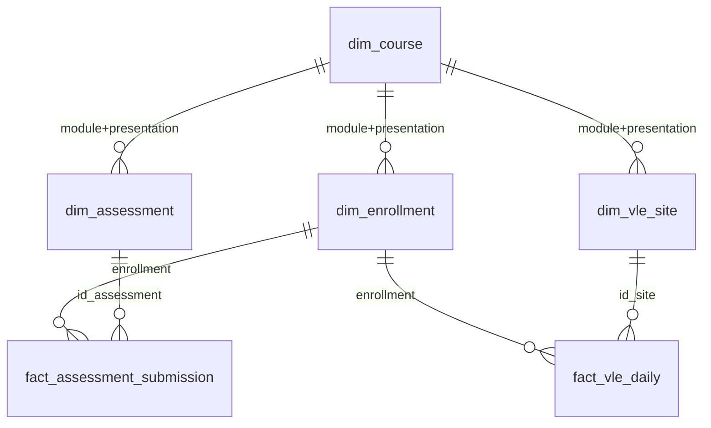

# OULAD — Thiết kế chuẩn (Canonical Design) v0.1

**Trạng thái:** `DRAFT` — chưa qua duyệt của nhóm (Cổng 1 giả lập). Đây là phần 4.1 đến 4.5 và 4.8 đến 4.10 của Task 4. Metric và dashboard nằm ở `model/metrics_and_dashboards.md`.
**Căn cứ:** `metadata/profile_report.json`, `metadata/source_manifest.json` (lần chạy ngày 07/10/2026, DuckDB 1.5.5, đo toàn bộ dòng) và `dictionary/data_dictionary.md` v1.0-draft.

## 0. Cách phân loại mệnh đề

| Nhãn | Nghĩa |
|---|---|
| `QUAN SÁT` | Đã đo trên lô dữ liệu này. Một quan sát **không** tự thành ràng buộc: lô sau có thể khác |
| `SUY LUẬN` | Suy ra từ tên cột và mô tả công bố của OULAD, chưa đối chiếu lại tài liệu gốc |
| `ĐỀ XUẤT` | Lựa chọn thiết kế, cần nhóm duyệt |

Không mệnh đề nào dưới đây được phân loại "từ source", vì chưa đối chiếu lại tài liệu mô tả gốc của OULAD (việc này còn trong danh sách ở mục 9). Khi đối chiếu xong, các mệnh đề `SUY LUẬN` khớp tài liệu sẽ được nâng cấp.

Nguyên tắc nền (theo đặc tả DataForge): chỉ ràng buộc đã được duyệt ở Cổng 1 mới sinh test bắt buộc; thống kê quan sát chỉ dùng để đề xuất.

---

## 1. Grain (mục 4.1)

### 1.1 Grain của 7 bảng nguồn (bronze)

| Bảng | Một dòng đại diện cho | Số dòng | Loại | Bằng chứng |
|---|---|---|---|---|
| `courses` | một module-presentation (một đợt mở của một module) | 22 | QUAN SÁT | khóa 2 cột duy nhất 100% |
| `assessments` | một bài đánh giá của một module-presentation | 206 | QUAN SÁT | `id_assessment` duy nhất 100% |
| `vle` | một học liệu (site) trên VLE của một module-presentation | 6.364 | QUAN SÁT | `id_site` duy nhất 100% |
| `studentInfo` | một lượt học (enrollment): một sinh viên trong một module-presentation | 32.593 | QUAN SÁT | khóa 3 cột duy nhất 100% |
| `studentRegistration` | thông tin đăng ký/hủy của đúng một enrollment | 32.593 | QUAN SÁT | khóa 3 cột duy nhất 100%, trùng tập khóa với `studentInfo` |
| `studentAssessment` | một lần nộp bài của một sinh viên cho một bài đánh giá | 173.912 | QUAN SÁT | khóa (`id_assessment`, `id_student`) duy nhất 100% |
| `studentVle` | **một bản ghi click đã tổng hợp** của một enrollment trên một học liệu trong một ngày tương đối. **Không phải** một dòng duy nhất cho mỗi tổ hợp đó | 10.655.280 | QUAN SÁT | khóa 5 cột chỉ duy nhất 79,39% |

Câu "một dòng = một sinh viên × một học liệu × một ngày" là **SAI** với dữ liệu này và không được dùng làm grain của `studentVle`. Danh tính của một dòng bronze là (`batch_id`, tên file, số dòng trong file), theo quy ước bốn cột truy vết của tầng bronze.

### 1.2 Grain của bảng đích (mart) đề xuất

| Bảng đích | Một dòng đại diện cho | Số dòng kỳ vọng | Loại |
|---|---|---|---|
| `dim_course` | một module-presentation | 22 | ĐỀ XUẤT |
| `dim_assessment` | một bài đánh giá | 206 | ĐỀ XUẤT |
| `dim_vle_site` | một học liệu | 6.364 | ĐỀ XUẤT |
| `dim_enrollment` | một lượt học, gộp `studentInfo` và `studentRegistration` | 32.593 | ĐỀ XUẤT |
| `fact_assessment_submission` | một lần nộp bài của một enrollment cho một bài đánh giá | 173.912 | ĐỀ XUẤT |
| `fact_vle_daily` | tổng click của một enrollment trên một học liệu trong một ngày tương đối (sau khi cộng dồn các dòng cùng khóa) | **8.459.320** | ĐỀ XUẤT, phụ thuộc quyết định F1 (mục 5, C09) |

Số dòng 8.459.320 của `fact_vle_daily` là số khóa 5 cột khác nhau đã đo trong `studentVle`, nên đây là giá trị kỳ vọng chính xác **nếu** quyết định F1 được duyệt.

---

## 2. Khóa (mục 4.2)

| Bảng | PK | Khóa ghép? | FK | Ứng viên khác | Vì sao chọn | Bằng chứng |
|---|---|---|---|---|---|---|
| `courses` | (`code_module`, `code_presentation`) | Có | không | không | Từng cột đơn lẻ không duy nhất: 7 và 4 giá trị khác nhau trên 22 dòng | duy nhất 100% |
| `assessments` | `id_assessment` | Không | (`code_module`, `code_presentation`) → `courses` | (`code_module`, `code_presentation`, `id_assessment`) cũng duy nhất nhưng thừa | `id_assessment` đã duy nhất toàn cục nên khóa đơn đủ | 206/206 duy nhất; 0 mồ côi |
| `vle` | `id_site` | Không | (`code_module`, `code_presentation`) → `courses` | không | `id_site` duy nhất toàn cục và nhất quán với module-presentation | 6.364/6.364; `studentVle` khớp 100% cả theo `id_site` riêng lẫn theo bộ ba |
| `studentInfo` | (`code_module`, `code_presentation`, `id_student`) | Có | (`code_module`, `code_presentation`) → `courses` | không | `id_student` **không** duy nhất: 28.785 giá trị khác nhau trên 32.593 dòng | duy nhất 100% |
| `studentRegistration` | (`code_module`, `code_presentation`, `id_student`) | Có | cùng bộ ba → `studentInfo` (1-1); (`code_module`, `code_presentation`) → `courses` | không | Quan hệ 1-1 với `studentInfo` | duy nhất 100%; 0 mồ côi hai chiều |
| `studentAssessment` | (`id_assessment`, `id_student`) | Có | `id_assessment` → `assessments` | không | Mỗi sinh viên nộp một lần cho mỗi bài | duy nhất 100% |
| `studentVle` | **không có** | — | (`code_module`, `code_presentation`, `id_student`) → `studentInfo`; `id_site` → `vle` | khóa 5 cột (`code_module`, `code_presentation`, `id_student`, `id_site`, `date`) bị loại | 1.614.505 nhóm trùng khóa, tối đa 10 dòng/khóa | 79,39% duy nhất |

**Khóa ngoại logic từ `studentAssessment` sang enrollment.** `studentAssessment` không mang `code_module`/`code_presentation`; hai giá trị này suy ra từ `assessments` qua `id_assessment`. Khóa enrollment của một lượt nộp là (`assessments.code_module`, `assessments.code_presentation`, `studentAssessment.id_student`). QUAN SÁT: 0 lượt nộp thuộc sinh viên chưa đăng ký đúng module-presentation của bài.

**Khóa thay thế ở mart.** Có thể đặt khóa thay thế số nguyên (surrogate key) cho `dim_enrollment` và `dim_course` để fact chỉ cần một cột nối. Đây là lựa chọn của Modeler; thiết kế chuẩn chấp nhận cả hai cách miễn là khóa tự nhiên vẫn được giữ và duy nhất.

---

## 3. Quan hệ (mục 4.3)

| Quan hệ (cha → con) | Cardinality | Loại | Đo được |
|---|---|---|---|
| `courses` → `assessments` | 1-N | QUAN SÁT | 22/22 course có bài, tối đa 14 bài/course |
| `courses` → `vle` | 1-N | QUAN SÁT | tối đa 529 học liệu/course |
| `courses` → `studentInfo` | 1-N | QUAN SÁT | tối đa 2.498 enrollment/course |
| `studentInfo` ↔ `studentRegistration` | **1-1** | QUAN SÁT | cùng tập khóa, mỗi khóa đúng 1 dòng |
| `assessments` → `studentAssessment` | 1-N | QUAN SÁT | 188/206 bài có lượt nộp; 18 bài không có (cả 18 là Exam) |
| `studentInfo` → `studentAssessment` (qua module-presentation của bài) | 1-N | QUAN SÁT | 0 vi phạm |
| `studentInfo` → `studentVle` | 1-N | QUAN SÁT | 29.228/32.593 enrollment có click; 3.365 không có |
| `vle` → `studentVle` | 1-N | QUAN SÁT | 6.268/6.364 học liệu có click; 96 không có |

**Quan hệ N-N về nghiệp vụ và bảng trung gian:**

| Quan hệ nghiệp vụ | Bảng trung gian | Ghi chú |
|---|---|---|
| sinh viên - bài đánh giá | `studentAssessment` | mang thuộc tính của quan hệ: `date_submitted`, `is_banked`, `score` |
| sinh viên - học liệu | `studentVle` | mang `date` và `sum_click`; do có dòng lặp nên không phải khóa duy nhất |
| sinh viên - module-presentation | `studentInfo` | mỗi sinh viên có từ 1 đến 5 lượt học |

---

## 4. Quy tắc nghiệp vụ và ràng buộc (mục 4.4)

### 4.1 Ràng buộc đề xuất đưa vào test (cần Cổng 1 duyệt)

Các ràng buộc này đều được dữ liệu hiện tại thỏa 100%. "Đề xuất" nghĩa là chúng chỉ thành test bắt buộc khi nhóm duyệt.

| ID | Quy tắc | Loại | Bằng chứng (lô hiện tại) | Tầng áp dụng |
|---|---|---|---|---|
| R01 | Khóa chính của 6 bảng (mục 2) duy nhất và không rỗng | ĐỀ XUẤT (QUAN SÁT 100%) | 6/6 bảng đạt 100% | silver, mart |
| R02 | Mọi khóa ngoại ở mục 2 tham chiếu tới bản ghi tồn tại (không tính quan hệ theo `id_student` riêng) | ĐỀ XUẤT (QUAN SÁT 0 mồ côi) | 0 dòng mồ côi | silver, mart |
| R03 | `studentRegistration` và `studentInfo` có cùng tập khóa (1-1) | ĐỀ XUẤT | 0 mồ côi hai chiều | silver |
| R04 | Mọi lượt nộp bài thuộc sinh viên đã đăng ký đúng module-presentation của bài | ĐỀ XUẤT | 0 vi phạm | silver |
| R05 | `score` nằm trong [0, 100] khi không rỗng | SUY LUẬN, ĐỀ XUẤT | 0 ngoài khoảng | silver |
| R06 | `sum_click` >= 1 | ĐỀ XUẤT | min = 1; 0 giá trị <= 0 | silver |
| R07 | `date_unregistration` >= `date_registration` khi cả hai có giá trị | SUY LUẬN, ĐỀ XUẤT | 0 vi phạm | silver |
| R08 | `week_from` <= `week_to` khi cả hai có giá trị | ĐỀ XUẤT | 0 vi phạm | silver |
| R09 | `assessments.date` <= `module_presentation_length` của course tương ứng khi có giá trị | ĐỀ XUẤT | 0 vi phạm | silver |
| R10 | `num_of_prev_attempts` >= 0; `studied_credits` > 0; `module_presentation_length` > 0 | ĐỀ XUẤT | min lần lượt 0, 30, 234 | silver |
| R11 | Các cột khóa không rỗng (chỉ các cột khóa, không phải mọi cột) | ĐỀ XUẤT | 0 rỗng ở các cột khóa | silver, mart |

**Ràng buộc miền giá trị (accepted_values), mức cảnh báo:** `gender` (M, F), `disability` (Y, N), `is_banked` (0, 1), `assessment_type` (TMA, CMA, Exam), `final_result` (Pass, Fail, Withdrawn, Distinction), `age_band` (3 nhóm), `highest_education` (5 mức), `region` (13 vùng), `code_module` (7), `code_presentation` (4). Đây là quan sát: theo nguyên tắc của DataForge, một giá trị mới có thể xuất hiện hợp lệ ở lô sau, nên mặc định đặt mức cảnh báo, chỉ chặn khi nhóm duyệt rõ.

### 4.2 Quan sát KHÔNG được biến thành test bắt buộc

Đây là các quy tắc "nghe hợp lý" nhưng dữ liệu thật vi phạm. Nếu Codegen sinh các test này, nó đang biến quan sát thành luật, vi phạm FR-08.

| ID | Quy tắc "nghe hợp lý" | Thực tế đo được |
|---|---|---|
| A1 | `studentVle` duy nhất theo (enrollment, site, ngày) | chỉ 79,39% duy nhất; 1.614.505 nhóm trùng |
| A2 | Tổng `weight` của bài không-Exam trong mỗi presentation bằng 100 | đúng ở 19/22; **bằng 0 ở cả 3 presentation của GGG** |
| A3 | Tổng `weight` của bài Exam trong mỗi presentation bằng 100 | đúng ở 20/22; **bằng 200 ở CCC 2014B và 2014J** (hai bài Exam, mỗi bài 100) |
| A4 | `final_result = Withdrawn` khi và chỉ khi `date_unregistration` có giá trị | 93 dòng Withdrawn không có ngày hủy; 9 dòng Fail có ngày hủy |
| A5 | `date_submitted` nằm trong [0, độ dài khóa] | 85 lượt sau khi hết khóa (tới 354 ngày); 2.057 lượt trước ngày bắt đầu |
| A6 | `id_student` duy nhất trong `studentInfo` | 28.785 trên 32.593 |
| A7 | Mọi bài đánh giá đều có lượt nộp | 18/206 bài không có (cả 18 là Exam) |
| A8 | Mọi enrollment và mọi học liệu đều có click | 3.365 enrollment và 96 học liệu không có |
| A9 | `imd_band`, `date_registration`, `assessments.date`, `score`, `week_from`, `week_to` không rỗng | rỗng lần lượt 1.111; 45; 11; 173; 5.243; 5.243 dòng |
| A10 | Mọi Exam có `date` | 11/24 bài Exam không có `date` |

---

## 5. Quy tắc làm sạch (mục 4.5)

Mỗi quy tắc theo cấu trúc **Vấn đề → Quyết định → Lý do → Tác động**. Tầng bronze luôn giữ nguyên giá trị gốc (mọi cột dạng chữ, không ép kiểu), nên các quyết định dưới đây áp dụng từ silver trở đi.

| ID | Vấn đề (QUAN SÁT) | Quyết định (ĐỀ XUẤT) | Lý do | Tác động |
|---|---|---|---|---|
| C01 | Giá trị thiếu luôn là chuỗi rỗng; không có `?`, `NA`, `NULL`... | Silver chuyển chuỗi rỗng thành NULL; bronze giữ nguyên | Một token duy nhất, rule đơn giản và kiểm chứng được | 7 cột có NULL (tổng ở bảng sau) |
| C02 | `imd_band` có nhóm `10-20` (3.516 dòng) thiếu `%` trong khi 9 nhóm còn lại có `%` | Silver chuẩn hóa `10-20` thành `10-20%` | Cùng một thang phân nhóm, một nhóm lệch cách viết sẽ tách đôi khi nhóm theo `imd_band` | 3.516 dòng đổi giá trị; cần Cổng 1 duyệt vì đây là thay đổi giá trị gốc |
| C03 | `imd_band` rỗng ở 1.111 dòng (3,41%), có mặt ở cả 22 presentation | Giữ NULL; không điền giá trị | Không có căn cứ để suy ra nhóm thiếu thốn | Ở dashboard, hiển thị nhãn "Không rõ" tại lớp trình bày, không sửa dữ liệu |
| C04 | `assessments.date` rỗng ở 11 dòng, cả 11 là Exam | Giữ NULL; không suy ra ngày thi | Không có nguồn xác định ngày thi | Chỉ số về nộp muộn loại các bài không có hạn |
| C05 | `vle.week_from`, `week_to` rỗng cùng nhau ở 5.243 dòng (82,39%) | Giữ NULL | Hai cột thiếu cùng lúc, nhiều khả năng cùng một nguyên nhân | Không dùng hai cột này làm chiều phân tích chính |
| C06 | `date_registration` rỗng ở 45 dòng (Withdrawn 39, Fail 5, Pass 1) | Giữ NULL | Không có căn cứ điền | Chỉ số thời điểm đăng ký loại 45 dòng này |
| C07 | `date_unregistration` rỗng ở 22.521 dòng (69,10%) | **Không** coi là thiếu: tạo cờ `has_unregistered = date_unregistration IS NOT NULL` | NULL ở đây mang nghĩa "không có sự kiện hủy" (SUY LUẬN) | Cờ có 10.072 dòng true |
| C08 | `score` rỗng ở 173 dòng (172 chưa banked, 1 banked) | Giữ NULL; trung bình điểm bỏ qua NULL; đếm lượt nộp vẫn tính các dòng này | Điểm thiếu không phải điểm 0 | Mẫu số của điểm trung bình nhỏ hơn số lượt nộp 173 |
| C09 | `studentVle` có 1.614.505 nhóm trùng khóa (73,0% trong số đó chứa nhiều giá trị `sum_click` khác nhau); 787.170 dòng trùng hoàn toàn | Bronze giữ mọi dòng. Mart cộng dồn: `fact_vle_daily.sum_click = SUM(sum_click)` theo khóa 5 cột | **ASSUMPTION:** mọi dòng là bản ghi hợp lệ cần cộng dồn. INSUFFICIENT EVIDENCE về nguyên nhân lặp | `fact_vle_daily` có 8.459.320 dòng. Bất biến kiểm chứng được: tổng `sum_click` của mart bằng tổng của bronze |
| C10 | `assessments.weight` có số lẻ (7,5; 12,5; 17,5) | Kiểu DECIMAL(5,2), không ép INTEGER | Ép nguyên làm mất phần lẻ | 206 dòng |
| C11 | Cột `date`, `date_submitted`, `date_registration`, `date_unregistration`, `week_*` là số ngày/tuần tương đối, có thể âm; dữ liệu không có cột ngày lịch nào | Kiểu INTEGER; ở mart đổi tên thành `*_day_offset` hoặc giữ tên và ghi rõ trong tài liệu; **không** tạo `dim_date` | Không thể quy đổi ra ngày lịch | Không có biểu đồ theo ngày/tháng thực |
| C12 | Mã số (`id_student` max 2.716.795, `id_site` max 1.077.905, `id_assessment` max 40.088) | Ép INTEGER | Không có số 0 đứng đầu, không có khoảng trắng (0 dòng) | Không cần bước trim/lpad |
| C13 | `final_result` và `date_unregistration` không khớp nhau ở 102 dòng (A4) | Giữ cả hai cột; chỉ số "rút học" tính từ `final_result`, chỉ số "hủy đăng ký" tính từ `has_unregistered`; ghi nhận số ngoại lệ | Không có căn cứ chọn bên nào đúng hơn | Hai chỉ số có thể khác nhau 102 dòng |
| C14 | Lượt nộp bài trước ngày bắt đầu (2.057) hoặc sau khi hết khóa (85) | Giữ nguyên; không loại, không sửa | Có thể là hành vi hợp lệ; chưa có căn cứ coi là lỗi | Ca kiểm thử outlier tự nhiên |
| C15 | Các cột phân loại khác (`gender`, `region`, `highest_education`, `age_band`, `disability`, `final_result`, `assessment_type`, `activity_type`) | Không cần chuẩn hóa | Mỗi giá trị chỉ có một cách viết (bảng đếm giá trị), không khoảng trắng thừa | Chỉ `imd_band` cần C02 |

Số dòng NULL theo cột: `assessments.date` 11; `vle.week_from` 5.243; `vle.week_to` 5.243; `studentInfo.imd_band` 1.111; `studentRegistration.date_registration` 45; `studentRegistration.date_unregistration` 22.521; `studentAssessment.score` 173. Mọi cột còn lại: 0.

**Kỳ vọng cho bước cách ly dòng lỗi ở silver:** với bộ quy tắc ở mục 4.1 và 5, **số dòng bị cách ly trên OULAD gốc là 0** (không dòng nào vi phạm R01 đến R11). Đây là mốc đối chiếu: nếu hệ thống cách ly bất kỳ dòng nào của OULAD sạch thì hoặc luật sinh ra khác bộ đã duyệt, hoặc có lỗi.

---

## 6. Mô hình đích đề xuất (mục 4.8)

Đây là một thiết kế hợp lệ trong nhiều thiết kế có thể chấp nhận. Tiêu chí chấm một thiết kế khác (theo đặc tả): có grain tường minh cho từng bảng, khóa và quan hệ đúng, tách fact/dimension hợp lý, mỗi lựa chọn có lý giải; không bắt buộc trùng tên bảng.

| Bảng | Nguồn | Cột chính | Ghi chú |
|---|---|---|---|
| `dim_course` | `courses` | `code_module`, `code_presentation`, `module_presentation_length` | 22 dòng |
| `dim_assessment` | `assessments` | `id_assessment`, `code_module`, `code_presentation`, `assessment_type`, `date`, `weight` | 206 dòng |
| `dim_vle_site` | `vle` | `id_site`, `code_module`, `code_presentation`, `activity_type`, `week_from`, `week_to` | 6.364 dòng |
| `dim_enrollment` | `studentInfo` ⋈ `studentRegistration` | khóa 3 cột; `gender`, `region`, `highest_education`, `imd_band`, `age_band`, `disability`, `num_of_prev_attempts`, `studied_credits`, `final_result`, `date_registration`, `date_unregistration`, `has_unregistered` | 32.593 dòng; gộp vì quan hệ 1-1 |
| `fact_assessment_submission` | `studentAssessment` + `assessments` | khóa enrollment, `id_assessment`, `date_submitted`, `is_banked`, `score` | 173.912 dòng |
| `fact_vle_daily` | `studentVle` (đã cộng dồn) | khóa enrollment, `id_site`, `date`, `sum_click` | 8.459.320 dòng (nếu duyệt C09) |

**Quyết định: chưa tạo `dim_student`.** Đã đo bằng `student_attribute_consistency`: trong 3.538 sinh viên có từ 2 lượt học trở lên, `gender`, `region`, `highest_education`, `disability`, `imd_band` nhất quán ở mọi sinh viên; riêng `age_band` thay đổi ở 72 sinh viên (2,04%). Vì `age_band` không nhất quán, không thể tách các thuộc tính nhân khẩu thành `dim_student` mà không làm mất thông tin. Giữ toàn bộ ở `dim_enrollment` (32.593 dòng). Đây là quyết định dựa trên bằng chứng đo được, không phải suy đoán.

**Quyết định: không tạo `dim_date`** vì dữ liệu chỉ có số ngày tương đối (C11).

**Bất biến kiểm chứng được cho mart (nếu duyệt thiết kế):**

| ID | Bất biến | Giá trị kỳ vọng |
|---|---|---|
| I1 | Số dòng `dim_enrollment` | 32.593 |
| I2 | Số dòng `fact_assessment_submission` | 173.912 |
| I3 | Số dòng `fact_vle_daily` | 8.459.320 |
| I4 | Tổng `sum_click` mart bằng tổng `sum_click` bronze | bằng nhau; tổng bronze = 39.605.099 (`reference_metrics`) |
| I5 | Mọi khóa ngoại của fact tồn tại trong dimension | 0 mồ côi |
| I6 | Số enrollment có ít nhất một dòng fact click | 29.228 |

---

## 7. Quy tắc cập nhật và kiểm thử theo tầng (mục 4.9)

| Nội dung | Quy định | Loại |
|---|---|---|
| Chính sách cập nhật | Snapshot thay thế toàn bộ: một lô mới thay thế hoàn toàn dữ liệu cũ, chạy hai lần cùng một lô không nhân đôi dữ liệu | Theo đặc tả bản đầu |
| Một lô cần nhiều file | OULAD cần đủ 7 file; chỉ chạy khi đủ và có cờ sẵn sàng | Theo đặc tả bản đầu |
| Bronze | Chấp nhận mọi bản ghi, mọi cột dạng chữ, kèm 4 cột truy vết (lô, file, số dòng, thời điểm nạp) | Theo đặc tả bản đầu |
| Silver | Chuẩn hóa kiểu, NULL, khử trùng lặp, cách ly dòng lỗi kèm lý do | Theo đặc tả bản đầu |
| Mart | Phải đạt ràng buộc đã duyệt (mục 4.1) | Theo đặc tả bản đầu |
| Khử trùng lặp ở silver với `studentVle` | **Không** khử trùng lặp bằng cách xóa dòng giống nhau cho tới khi quyết định F1 được duyệt | ĐỀ XUẤT |
| Lô đổi schema | Dừng và hỏi Engineer | Theo đặc tả bản đầu |
| Mục tiêu test trên dữ liệu sạch | 100% test đã duyệt đạt trên OULAD gốc | ĐỀ XUẤT |

---

## 8. Câu hỏi Modeler nên hỏi lại (mục 4.10, ground truth cho FR-05)

Đặc tả yêu cầu Modeler hỏi lại khi nghiệp vụ hoặc grain mơ hồ. Với OULAD, hồ sơ thống kê không đủ để quyết định các điểm sau:

| ID | Câu hỏi | Vì sao mơ hồ (QUAN SÁT) | Mức |
|---|---|---|---|
| Q1 | Các dòng `studentVle` cùng (enrollment, học liệu, ngày) là bản ghi cần cộng dồn, bản sao cần loại, hay lỗi? | 1.614.505 nhóm trùng khóa; 73,0% có giá trị `sum_click` khác nhau | **Bắt buộc phải hỏi** trước khi chốt grain của `fact_vle_daily` |
| Q2 | Tỉ lệ đạt tính trên tất cả enrollment hay chỉ trên enrollment không rút học? | `final_result` có 4 giá trị, Withdrawn chiếm 31,16% | Nên hỏi |
| Q3 | Điểm đã được banked (`is_banked = 1`, 1.909 dòng) có tính vào điểm trung bình không? | Cột là cờ chuyển điểm từ lần học trước (SUY LUẬN) | Nên hỏi |
| Q4 | 18 bài Exam không có lượt nộp (18/24) và 11 bài Exam không có ngày có bị loại khỏi chỉ số hiệu suất không? | Xem A7, A10 | Nên hỏi |
| Q5 | Bài có `weight = 0` (56 bài) có tham gia điểm tổng kết có trọng số không? | Tổng trọng số không nhất quán giữa các module (A2, A3) | Nên hỏi |

Hành vi kỳ vọng: Modeler đưa ra danh sách câu hỏi chứa ít nhất Q1 thay vì tự chọn một grain; Q2 đến Q5 là các câu hỏi tốt nhưng một thiết kế vẫn hợp lệ nếu ghi rõ giả định thay vì hỏi.

---

## 9. Việc còn lại

| # | Việc | Điều kiện hoàn thành |
|---|---|---|
| 1 | (Xong) Đo bằng bản chạy đầy đủ v2.1 | Đã quyết định `dim_student` (không tách) và điền giá trị tham chiếu |
| 2 | Nhóm duyệt C02, C09, C13 và các ràng buộc ở mục 4.1 | Mỗi mục có trạng thái Approved hoặc Rejected |
| 3 | Đối chiếu mô tả gốc của OULAD để nâng `SUY LUẬN` lên mức có nguồn | Các mệnh đề khớp được gắn nhãn nguồn |
| 4 | Người viết Modeler/Codegen xác nhận mô hình đích và các bất biến I1 đến I6 là kiểm tra được | Có phản hồi từ thành viên sở hữu module |
